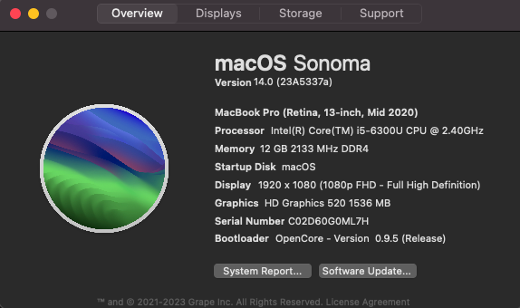
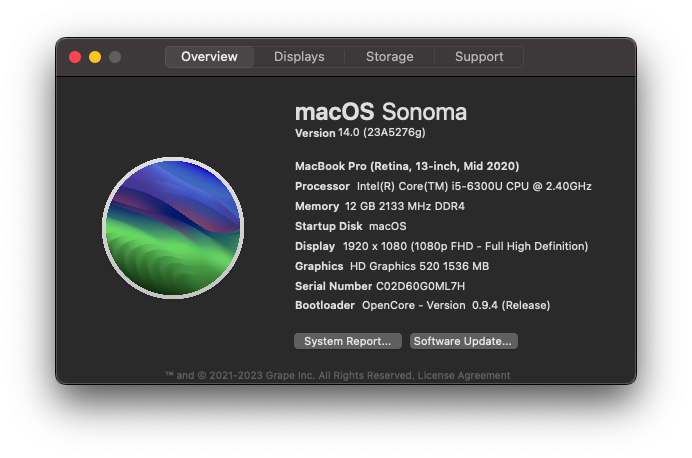

## Screenshots

**Versão macOS suportada**: 13.0 - 14.0
 
**Versão OpenCore**: 0.9.4 (Preview)
 
**Data de Lançamento**: 04/07/2023

## Especificações de Hardware

|Itens|Descrição|
|-|:-------:|
|CPU|Intel Core i5-6300U (Skylake)|
|Memória|8GB DDR4|
|Armazenamento|NVMe SanDisk x400 256GB|
|GPU|Intel(R) UHD Graphics 520|
|Ethernet|Intel I219-LM PCI-E Gigabit Ethernet Adapter|
|WLAN|Intel Wireless Gigabit Ethernet 802.11AC (M.2, 8260AC)|
|Bluetooth|Intel Bluetooth(R) 4.1|
|Áudio|Realtek ALC293 (ALC3235)|
|Tela|12,5" 60Hz|
|Webcam|USB Buil-in|
|Leitor de Cartão|USB Built-in|
|TouchPad & Teclado|HID I2C|

## O que esta funcionando?
- WiFI
- Áudio
- HDMI/DP
- Ethernet
- Bluetooth (Ainda de forma instável)
- Webcam
- Todas as portas USB
- Tudo relacionado ao iCloud (Drive, iMessage, Facetime, etc)

## O que não esta funcionando?
Até o momento tudo funcionando

## Obrigado/Créditos
- [Opencore Team](https://dortania.github.io/getting-started/)
- [OpenIntelWireless](https://github.com/OpenIntelWireless)
- [Acidanthera](https://github.com/acidanthera)
- [FireWolf](https://github.com/0xFireWolf/RealtekCardReader)
